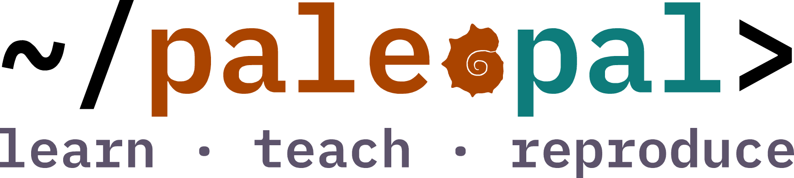

# paleopal

A point-and-click web app for reproducible paleobiology analyses. Assemble a
workflow step by step — import occurrence data, clean and summarize it, and
build figures — and **paleopal** writes the equivalent, reproducible R script
for you to download.

Built on the [shinypal](https://github.com/willgearty/shinypal) framework and
served in the browser with [shinylive](https://posit-dev.github.io/r-shinylive/),
so there is nothing to install.

**Try it:** <https://williamgearty.com/paleopal/>
